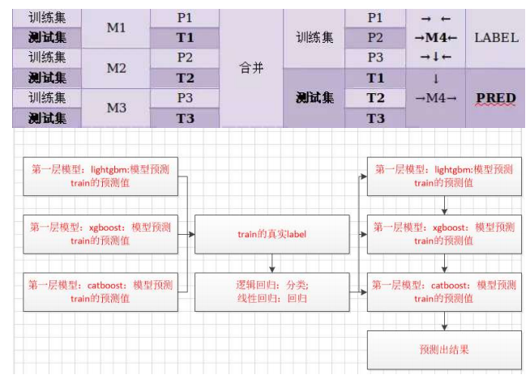
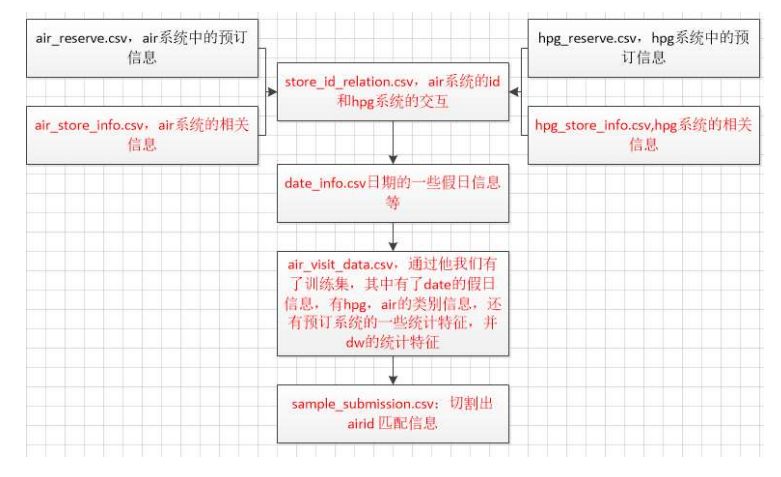

### 1.模型融合
+   分类stacking 
    >  from mlxtend.classifier import StackingClassifier
### 2.房价预测
+   增加特征重要性feature_importance   
	> xgboost lightgbm catboost模型训练预测
	> 5-kfold相加得到的特征重要性    
	> 筛选出特征重要性为0的特征，删除特征
	> 再次训练
### 2.Recruit Restaurant Visitor Forecasting
+	##### 时间序列模型 
+   ##### 进一步特征工程
    > ① 增加训练集，往往模型会更优更具有鲁棒性，对于时序问题，增加窗口可以叠加训练集       
	> ② 增加强特，对时序特征增加不同窗口的中位数，最大值，最小值等
+   ##### https://www.kaggle.com/code/plantsgo/solution-public-0-471-private-0-505/script

